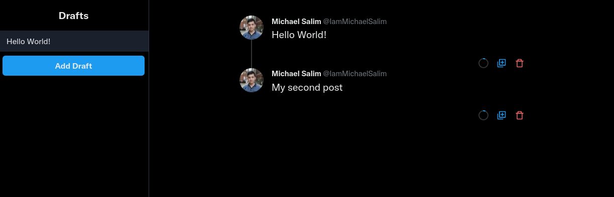

# Tweet Robot

Tweet Robot aims to provide an easy way to automate your Tweets. You can create a thread and schedule for it to run at a certain time.

This project is still work in progress!



TODO:

- Scheduling on Frontend
- Setup cron
- Custom sqlite path
- Docker deployment
- Better documentation

## Goals

- Easily self hosted
- Minimal footprint to make it easy to host

## Build Prerequisites

- `cargo`
- `yarn`

## Get Started (running the dev server)

- Clone the repo
- `cd tweet-robot`
- `make web-install`
- `make`

## Modules

Tweet Robot is made up of 2 modules:

- **Core**
  A Rust web-server that constantly checks the database for tweet to publish. It also provides some API endpoints that can be used to schedule tweets.
- **Web**
  A React front-end that connects to the core through API for GUI access to schedule tweets.

## API

Standard REST. Docs TBD

## Time

Time should be in UTC

## Twitter API access

For authentication, we use [OAuth 1.0a](https://developer.twitter.com/en/docs/authentication/oauth-1-0a). The keys are to be inserted through environment variables. Here's the keys you need:

```
ACCESS_TOKEN
ACCESS_TOKEN_SECRET
API_KEY
API_KEY_SECRET
```

To get the keys, sign up to [Twitter's developer's platform](https://developer.twitter.com/en). You just need to fill in some forms. The process should be pretty straightforward.
